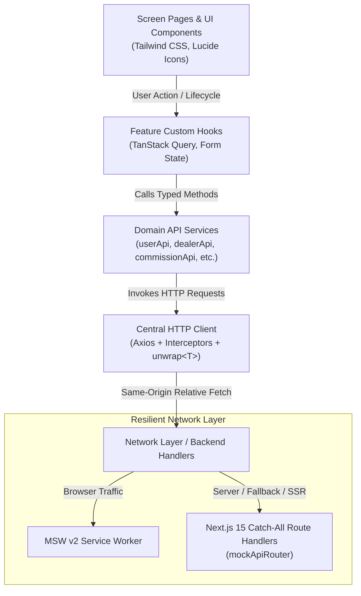
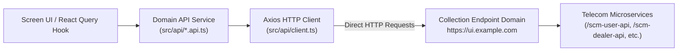
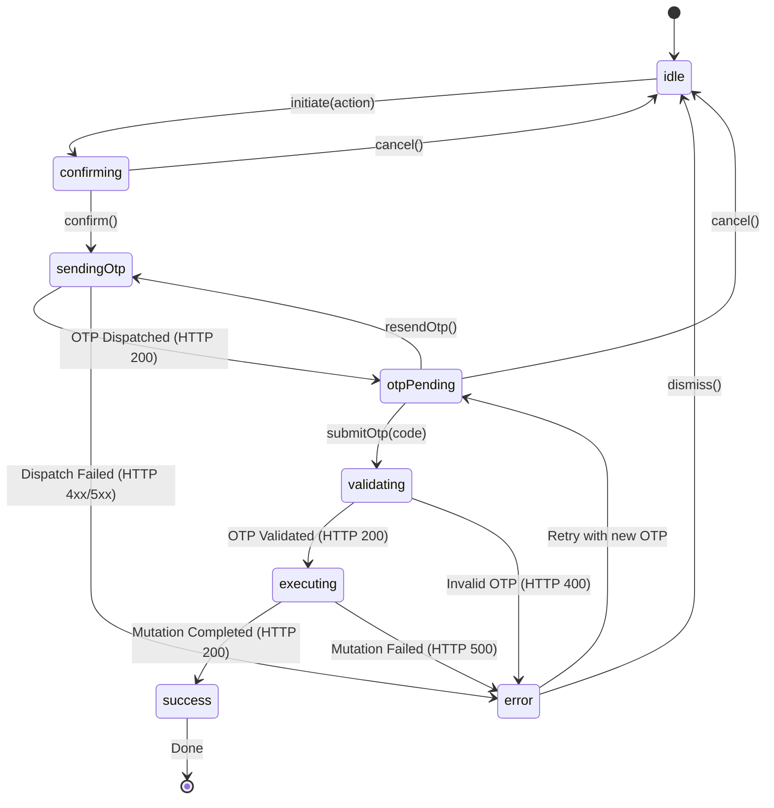

# SCM Portal — Comprehensive Architecture & Design Specification

## 1. System Overview

The **Sales Channel Management (SCM) Portal** is an enterprise-grade telecom channel administration web application. It automates and governs the lifecycle of channel partners, administrative identities, commission incentive structures, tariff plans, and financial ledger adjustments across a national multi-tier telecom hierarchy.

Key domain capabilities include:
- **User Administration**: Granular role-based provisioning across 18 permission flags, HRMS employee linking, status toggling, and password/credential governance.
- **Dealer & Franchise Management**: 3-level channel partner hierarchy (Channel Partner $\rightarrow$ Franchise $\rightarrow$ Sub-Franchise $\rightarrow$ POS Agent), PAN/Aadhaar deduplication, live status verification, and secure MPIN resets.
- **Commission Engine**: Multi-tab configuration for Prepaid FRC (First Recharge Coupon), Prepaid OTF (On-The-Fly), Postpaid acquisition incentives, Landline/Broadband, and Franchise Balance top-up reviews with two-factor authorization.
- **Plans, Denominations & Number Portability**: Tariff catalog administration, circle-specific denomination matrices, MNP (Mobile Number Portability) port-in ledger, and MSISDN number series allocation.
- **Financial Governance & Audit**: Franchise balance top-up approval/rejection queues, wallet balance adjustments, and full audit trails.

---

## 2. Layered Architecture Pattern (5-Tier Unidirectional Data Flow)

The application strictly enforces a 5-tier unidirectional data flow to guarantee separation of concerns, testability, and deterministic behavior:



### Core Invariants:
1. **Zero Direct Fetching**: UI components NEVER call `fetch()` or `axios` directly. All network interaction is mediated through domain API services and custom React Query hooks.
2. **Standardized Envelope Handling**: Telecom endpoints return `{ status: number, message: string, data: T }`. The centralized Axios response interceptor unwraps the payload via `unwrap<T>()` and normalizes all transport or application errors into an `ApiError` interface.
3. **5-State Resilient UI**: Every data-driven screen and table cleanly renders all 5 standard lifecycle states:
   - **Loading**: Pulse skeletons matching table column layout
   - **Success**: Fully formatted data table with pagination, sorting, and search filtering
   - **Empty**: Informative icon, friendly empty-state guidance, and primary action button
   - **Error**: High-visibility alert banner with backend error message and diagnostic context
   - **Retry**: Dedicated "Retry" button that triggers `query.refetch()` without reloading the page

---

## 3. Real Collection API Endpoints Architecture

The application communicates directly with the real API endpoints specified in `SCM_APIs.postman_collection.json`:



1. **Direct Collection Base URL**: `NEXT_PUBLIC_API_BASE_URL` is configured to `https://ui.example.com` (from the Postman collection contract).
2. **Zero Mock Services**: No local mock server routes or browser service workers (MSW) intercept or fabricate data.
3. **5-State Resilient Network Boundary**: Any real network outcome (HTTP 200, 4xx, 5xx, or DNS/network reachability errors) is intercepted by the Axios error normalizer and cleanly rendered by `<ApiError>` with an interactive retry trigger.

---

## 4. Finite State Machine for OTP-Guarded Mutations

Telecom write operations (e.g., Commission Saving, User Creation, Dealer Status Change, MPIN Reset, Franchise Top-up Approval) are OTP-protected. The portal implements a deterministic finite state machine via `useOtpGuardedAction`:



### FSM Invariants:
- **No Concurrent Invocations**: `submitOtp()` is strictly guarded; if `state !== 'otpPending' && state !== 'error'`, duplicate invocations (e.g. rapid double clicks) are immediately rejected.
- **Single-Flight Mutations**: The target mutation is only executed once the state reaches `executing`, preventing duplicate ledger updates or duplicate dealer creation.

---

## 5. Role-Based Access Control (RBAC) & `<PermissionGuard />`

The portal provides 6 pre-configured telecom roles with an 18-flag granular entitlement matrix:

| Permission Flag | Super Admin | Channel Ops Admin | Circle Finance Manager | Field Sales Supervisor | Finance & Wallet Auditor | Read-Only Compliance Auditor |
|---|:---:|:---:|:---:|:---:|:---:|:---:|
| `userPermissions` | ✅ | ✅ | ❌ | ❌ | ❌ | ❌ |
| `dealerPermissions` | ✅ | ✅ | ❌ | ✅ | ❌ | ❌ |
| `commissionPermissions` | ✅ | ❌ | ✅ | ❌ | ❌ | ❌ |
| `plansNumberpermissions` | ✅ | ✅ | ❌ | ❌ | ❌ | ❌ |
| `reportsPermissions` | ✅ | ✅ | ✅ | ✅ | ✅ | ✅ |
| `editAccess` | ✅ | ✅ | ✅ | ❌ | ❌ | ❌ |
| `deleteAccess` | ✅ | ❌ | ❌ | ❌ | ❌ | ❌ |
| `franchisePermissions` | ✅ | ✅ | ✅ | ❌ | ✅ | ❌ |

### Enforcement Mechanics:
1. **Page-Level Protection**: Every route (`/users`, `/dealers`, `/commissions`, `/plans`, `/reports`) is wrapped in `<PermissionGuard permission="...">`. Unauthorized roles receive a clear access-restricted banner.
2. **Query Inactivation**: React Query hooks inject `enabled: hasPermission`, preventing unentitled network fetches.
3. **Action-Level Protection**: Buttons for sensitive operations (Add Plan, Save Commission, Purge Dealer) are conditionally rendered or disabled based on `editAccess` and `deleteAccess`.
4. **Dev Permission Switcher**: A floating diagnostic widget allows instant switching between all 6 personas during live demos and testing.

---

## 6. Geographic Cascade Architecture (`useZoneCircleSSA`)

Telecom entities (Dealers, Users, Commissions, Denominations) are partitioned by geographic jurisdiction:
- **Zone** (North, South, East, West)
- **Circle** (State/Telecom License Service Area, e.g. Delhi, Karnataka, Maharashtra)
- **SSA** (Secondary Switching Area / District, e.g. Bangalore, Mysore)

The `useZoneCircleSSA` hook manages cascading dependencies:
- Changing the selected Zone automatically resets Circle and SSA selections.
- Changing Circle queries the circle-specific SSAs and resets SSA.
- Circle options are dynamically fetched via `/scm-db-api/masterdata-db-api/zonebasedcircles?zoneId={id}`.

---

## 7. Reusable Component Abstraction Layer (12 Mandated Components)

All 12 mandatory component abstractions defined in Part D of the Hackathon specification are isolated under `src/components/`:

1. **`<ZoneSelector />`** (`src/components/forms/ZoneSelector.tsx`): Dropdown for Zone selection.
2. **`<CircleSelector />`** (`src/components/forms/CircleSelector.tsx`): Cascading Circle dropdown, disabled until Zone is selected.
3. **`<SSASelector />`** (`src/components/forms/SSASelector.tsx`): Cascading SSA dropdown, disabled until Circle is selected.
4. **`<OTPVerificationModal />`** (`src/components/feedback/OTPVerificationModal.tsx`): Accessible 4-box OTP input with countdown timer and focus management.
5. **`<ConfirmationDialog />`** (`src/components/feedback/ConfirmationDialog.tsx`): Confirmation dialog for destructive actions.
6. **`<SearchToolbar />`** (`src/components/tables/SearchToolbar.tsx`): Search bar with debounced input and clear triggers.
7. **`<DataTable />`** (`src/components/tables/DataTable.tsx`): Generic, sortable, paginated data table with zero height-shift layout.
8. **`<StatusBadge />`** (`src/components/tables/StatusBadge.tsx`): Color-coded status pills for ACTIVE, INACTIVE, SUSPENDED, PENDING.
9. **`<PermissionGuard />`** (`src/components/forms/PermissionGuard.tsx`): RBAC gate protecting routes and UI actions.
10. **`<FormSection />`** (`src/components/forms/FormSection.tsx`): Card container for form fields with subheader styling.
11. **`<ApiError />`** (`src/components/feedback/ApiError.tsx`): Standardized error display with retry capability.
12. **`<LoadingState />`** (`src/components/feedback/LoadingState.tsx`): Pulse skeleton loader matching column structures.

---

## 8. State Management & Caching Strategy

- **Server State (TanStack Query v5):** All microservice data fetching, caching, deduplication, and optimistic updates are handled by React Query. Cache keys are strictly namespaced (e.g. `['users']`, `['dealers-list']`, `['commissions-frc']`).
- **Client Auth State (Zustand):** Persona switching and active role permissions are managed in a lightweight Zustand store with localStorage persistence (`dev-permissions-storage`).

---

## 9. Form Validation Architecture (Zod Schemas)

Form input structures are validated using type-safe Zod schemas located in `src/schemas/`:
- `user.schema.ts`: HRMS ID validation, 10-digit mobile number, password rules, 18 permission flags.
- `dealer.schema.ts`: Business name, PAN pattern (`[A-Z]{5}[0-9]{4}[A-Z]{1}`), Aadhaar pattern (`[0-9]{12}`), parent dealer MSISDN.
- `commission.schema.ts`: Denomination range bounds, percentage rate capping, circle/category validation.
- `plan.schema.ts`: Plan code, validity days, denomination price rules.

---

## 10. Automated Testing Strategy (Testing Pyramid)

```mermaid
pyramid
    title SCM Testing Pyramid
    E2E ["Playwright E2E Business Journeys (User Creation, Commission Config, Tariff Plans)"]
    Integration ["MSW + RTL Integration Tests (User + OTP Flow, Commission + OTP Flow)"]
    Unit ["Vitest Unit Tests (Zod Schemas, OTP FSM, Permission Hooks, Data Tables)"]
```

1. **Unit Tests (`tests/unit/`):** Test Zod validation schemas, OTP state machine transitions, permission hooks, and table renderers.
2. **Integration Tests (`tests/integration/`):** Test multi-step workflows (Create User $\rightarrow$ Send OTP $\rightarrow$ Validate OTP $\rightarrow$ Save User).
3. **E2E Tests (`tests/e2e/`):** Playwright automated journeys running against live pages.
