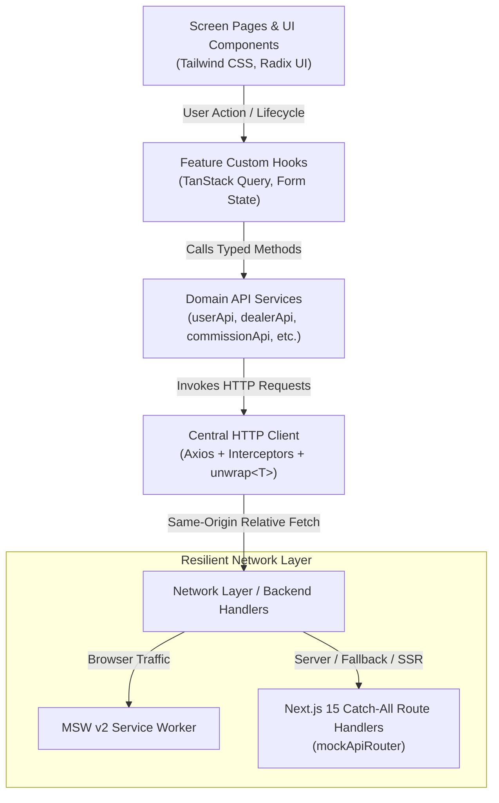
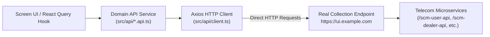
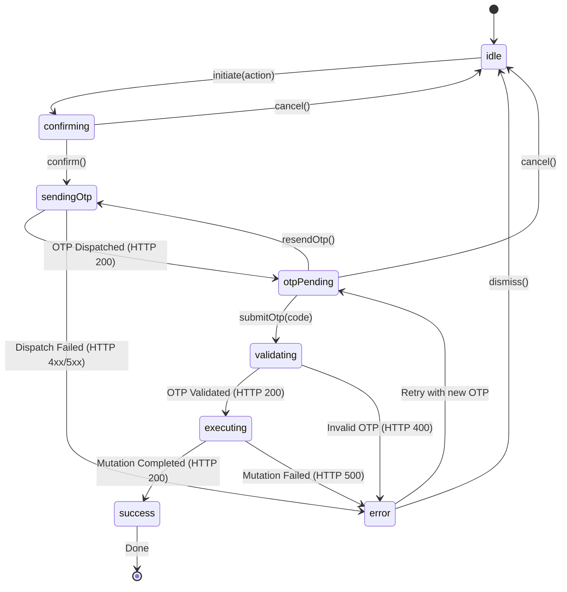

# SCM Portal — Comprehensive Architecture & Design Specification

## 1. System Overview

The **Sales Channel Management (SCM) Portal** is an enterprise-grade telecom channel administration web application. It automates and governs the lifecycle of channel partners, administrative identities, commission incentive structures, tariff plans, and financial ledger adjustments across a national multi-tier telecom hierarchy.

Key domain capabilities include:
- **User Administration**: Granular role-based provisioning across 18 permission flags, HRMS employee linking, status toggling, and password/credential governance.
- **Dealer & Franchise Management**: 3-level channel partner hierarchy (Channel Partner → Franchise → Sub-Franchise → POS Agent), PAN/Aadhaar deduplication, live status verification, and secure MPIN resets.
- **Commission Engine**: Multi-tab configuration for Prepaid FRC (First Recharge Coupon), Prepaid OTF (On-The-Fly), Postpaid acquisition incentives, Landline/Broadband, and Franchise Balance top-up reviews with two-factor authorization.
- **Plans, Denominations & Number Portability**: Tariff catalog administration, circle-specific denomination matrices, MNP (Mobile Number Portability) port-in ledger, and MSISDN number series allocation.
- **Financial Governance & Audit**: Franchise balance top-up approval/rejection queues, wallet balance adjustments, and full audit trails.

---

## 2. Layered Architecture Pattern (5-Tier Unidirectional Data Flow)

The application strictly enforces a 5-tier unidirectional data flow to guarantee separation of concerns, testability, and deterministic behavior:

### Core Invariants:
1. **Zero Direct Fetching**: UI components NEVER call `fetch()` or `axios` directly. All network interaction is mediated through domain API services and custom React Query hooks.
2. **Standardized Envelope Handling**: Telecom endpoints return `{ status: number, message: string, data: T }`. The centralized Axios response interceptor unwraps the payload via `unwrap<T>()` and normalizes all transport or application errors into an `ApiError` interface.
3. **5-State Resilient UI**: Every data-driven screen and table cleanly renders all 5 standard lifecycle states:
   - **Loading**: Pulse skeletons matching table column layout
   - **Success**: Fully formatted data table with pagination, sorting, and search filtering
   - **Empty**: Informative icon, friendly empty-state guidance, and primary action button
   - **Error**: High-visibility alert banner with backend error message and diagnostic context
   - **Retry**: Dedicated "Retry" button that triggers `query.refetch()` without reloading the page

---

## 3. Real Collection API Endpoints Architecture

The application communicates directly with the real API endpoints specified in `SCM_APIs.postman_collection.json`:

1. **Direct Collection Base URL**: `NEXT_PUBLIC_API_BASE_URL` is configured to `https://ui.example.com` (from the Postman collection contract).
2. **Zero Mock Services**: No local mock server routes or browser service workers (MSW) intercept or fabricate data.
3. **5-State Resilient Network Boundary**: Any real network outcome (HTTP 200, 4xx, 5xx, or DNS/network reachability errors) is intercepted by the Axios error normalizer and cleanly rendered by `<ApiError>` with an interactive retry trigger.

---

## 4. Finite State Machine for OTP-Guarded Mutations

Telecom write operations (e.g., Commission Saving, User Creation, Dealer Status Change, MPIN Reset, Franchise Top-up Approval) are OTP-protected. The portal implements a deterministic finite state machine via `useOtpGuardedAction`:

### FSM Invariants:
- **No Concurrent Invocations**: `submitOtp()` is strictly guarded; if `state !== 'otpPending' && state !== 'error'`, duplicate invocations (e.g. rapid double clicks) are immediately rejected.
- **Single-Flight Mutations**: The target mutation is only executed once the state reaches `executing`, preventing duplicate ledger updates or duplicate dealer creation.

---

## 5. Role-Based Access Control (RBAC) & `<PermissionGuard />`

The portal provides 6 pre-configured telecom roles with a 18-flag granular entitlement matrix:

| Permission Flag | Super Admin | Channel Ops Admin | Circle Finance Manager | Field Sales Supervisor | Finance & Wallet Auditor | Read-Only Compliance Auditor |
|---|:---:|:---:|:---:|:---:|:---:|:---:|
| `userPermissions` | ✅ | ✅ | ❌ | ❌ | ❌ | ❌ |
| `dealerPermissions` | ✅ | ✅ | ❌ | ✅ | ❌ | ❌ |
| `commissionPermissions` | ✅ | ❌ | ✅ | ❌ | ❌ | ❌ |
| `plansNumberpermissions` | ✅ | ✅ | ❌ | ❌ | ❌ | ❌ |
| `reportsPermissions` | ✅ | ✅ | ✅ | ✅ | ✅ | ✅ |
| `editAccess` | ✅ | ✅ | ✅ | ❌ | ❌ | ❌ |
| `deleteAccess` | ✅ | ❌ | ❌ | ❌ | ❌ | ❌ |
| `franchisePermissions` | ✅ | ✅ | ✅ | ❌ | ✅ | ❌ |

### Enforcement Mechanics:
1. **Page-Level Protection**: Every route (`/users`, `/dealers`, `/commissions`, `/plans`, `/reports`) is wrapped in `<PermissionGuard permission="...">`. Unauthorized roles receive a clear access-restricted banner.
2. **Query Inactivation**: React Query hooks inject `enabled: hasPermission`, preventing unentitled network fetches.
3. **Action-Level Protection**: Buttons for sensitive operations (Add Plan, Save Commission, Purge Dealer) are conditionally rendered or disabled based on `editAccess` and `deleteAccess`.
4. **Dev Permission Switcher**: A floating diagnostic widget allows instant switching between all 6 personas during live demos and testing.

---

## 6. Geographic Cascade Architecture (`useZoneCircleSSA`)

Telecom entities (Dealers, Users, Commissions, Denominations) are partitioned by geographic jurisdiction:
- **Zone** (North, South, East, West)
- **Circle** (State/Telecom License Service Area, e.g. Delhi, Karnataka, Maharashtra)
- **SSA** (Secondary Switching Area / District, e.g. Bangalore, Mysore)

The `useZoneCircleSSA` hook manages cascading dependencies:
- Changing the selected Zone automatically resets Circle and SSA selections.
- Changing Circle queries the circle-specific SSAs and resets SSA.
- Circle options are dynamically fetched via `/scm-db-api/masterdata-db-api/zonebasedcircles?zoneId={id}`.
